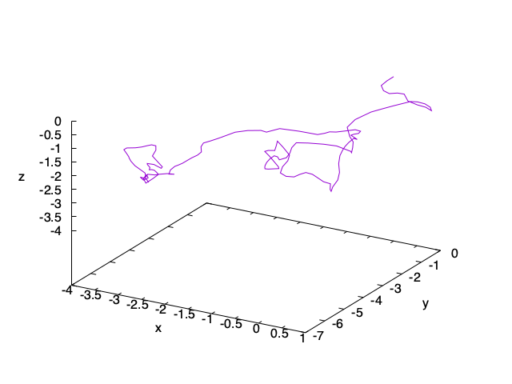
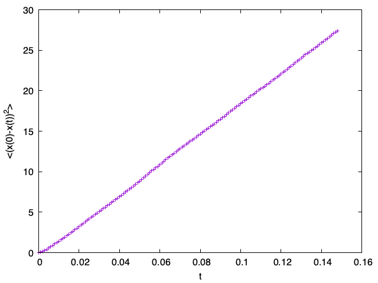

# LAMMPSを使った拡散現象の計算サンプル

## 概要

LAMMPSで流体状態にあるLennard-Jones系を時間発展させ、その平均自乗変位を調べる。

## 使い方

最初に初期配置を作る。

```sh
$ python3 generate_config.py 
Generated diffusion.atoms
```

すると、`diffusion.atoms`が作成される。

LAMMPSを実行する。

```sh
lmp_serial < diffusion.input 
```

トラジェクトリファイル(ダンプファイル)として`diffusion.lammpstrj`が作成される。

これをつかって拡散係数を計算するのが`diffusion.py`。実行すると標準出力に平均自乗変位の時間依存性`diffusion.dat`と、番号0の原子の軌跡`trajectory.dat`を出力する。

```sh
$ python3 diffusion.py
Generated diffusion.dat
Generated trajectory.dat
```

それをgnuplotでプロットする。まずは軌跡。

```sh
gnuplot trajectory.plt
```

実行すると`trajectory.png`ができる。



拡散しているように見える。

次に、平均自乗変位を出力する。

```sh
gnuplot diffusion.plt
```

実行すると`diffusion.png`ができる。



平均自乗変位が時間に比例していることがわかる。

## LICENSE

MIT
